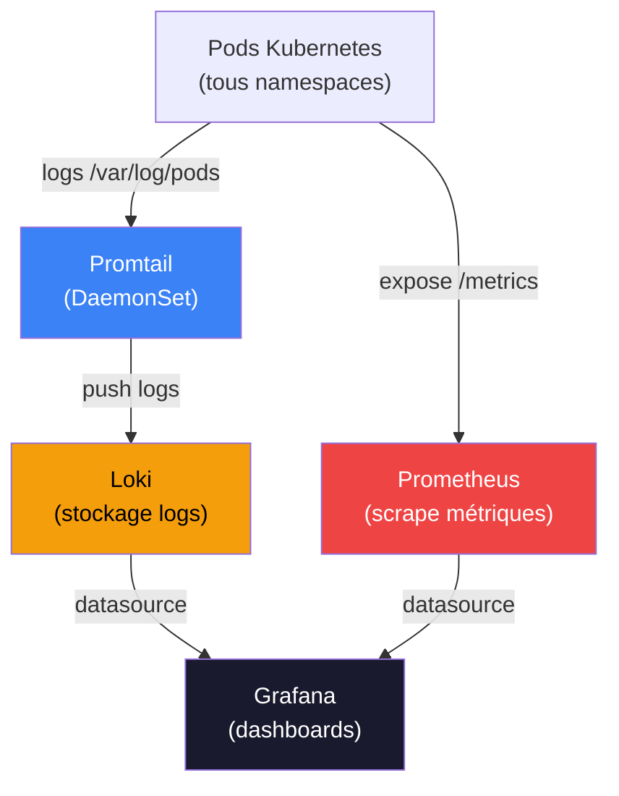

# Observabilité sur Kubernetes — Logs & Métriques avec Loki, Promtail, Prometheus et Grafana

Prérequis — on sait déployer et synchroniser des applications sur Kubernetes via HELM. On va maintenant introduire l'**observabilité** : collecter les logs et les métriques du cluster pour les visualiser dans Grafana.

> **Prérequis :** minikube démarré, Helm 3+ installé, ArgoCD optionnel.

---

# PHASE 0 — Pourquoi l'observabilité ?

## Le problème sans observabilité

Un cluster Kubernetes qui tourne, c'est bien. Mais sans observabilité :

- **Comment savoir qu'un pod crashe en boucle ?** `kubectl get pods` toutes les 5 minutes ?
- **Pourquoi cette requête a échoué il y a 2h ?** Les logs sont partis avec le pod redémarré
- **Le cluster est-il en train de saturer la mémoire ?** Aucune idée sans métriques
- **Quelle application consomme le plus de CPU ?** Mystère

## La réponse : la stack PLG + Prometheus

/!\ Promtail deprecated et remplacé par Alloy

```
Logs  ──► Promtail ──► Loki  ──► Grafana
                                    ▲
Métriques ──► Prometheus ───────────┘
```

| Outil | Rôle |
|---|---|
| **Promtail** | Agent de collecte de logs — tourne sur chaque nœud (DaemonSet), lit les logs des pods /!\ Promtail deprecated et remplacé par Alloy |
| **Loki** | Stockage et indexation des logs (comme Elasticsearch, mais léger) |
| **Prometheus** | Collecte et stockage des métriques (CPU, RAM, requêtes HTTP...) |
| **Grafana** | Interface de visualisation — dashboards, alertes, exploration |

---

# PHASE 1 — Préparer l'environnement

## Etape 1 — Vérifier les prérequis

```bash
# Minikube doit tourner
minikube status

# Helm doit être installé
helm version
# version.BuildInfo{Version:"v3.x.x"...}
```

Si Helm n'est pas installé :
```bash
# macOS
brew install helm

# Linux
curl https://raw.githubusercontent.com/helm/helm/main/scripts/get-helm-3 | bash
```

## Etape 2 — Créer le namespace d'observabilité

On regroupe tous les outils dans un namespace dédié `obs` :

```bash
kubectl create namespace obs
```

---

# PHASE 2 — Déployer Loki (stockage de logs)

**Loki** est le système de stockage de logs. Il ne collecte pas les logs lui-même — c'est le rôle de Promtail — il les reçoit, les indexe et les expose pour Grafana.

On utilise le mode **SingleBinary** : un seul pod qui fait tout (adapté au lab, pas à la production).

## Etape 3 — Ajouter le repo Helm Grafana

```bash
helm repo add grafana https://grafana.github.io/helm-charts
helm repo update
```

## Etape 4 — Créer le fichier de configuration Loki

Créer le fichier `obs/loki-values.yaml` (ou utiliser celui fourni) :

```yaml
loki:
  # Mode sans authentification — pas besoin de X-Scope-OrgID ni de tenant_id
  auth_enabled: false
  commonConfig:
    replication_factor: 1
  schemaConfig:
    configs:
      - from: "2024-04-01"
        store: tsdb
        object_store: s3
        schema: v13
        index:
          prefix: loki_index_
          period: 24h
  pattern_ingester:
      enabled: true
  limits_config:
    allow_structured_metadata: true
    volume_enabled: true

minio:
  enabled: true

# Désactiver les caches (inutiles en lab)
chunksCache:
  enabled: false
resultsCache:
  enabled: false

deploymentMode: SingleBinary
singleBinary:
  replicas: 1

# Désactiver tous les autres modes de déploiement
backend:
  replicas: 0
read:
  replicas: 0
write:
  replicas: 0
```

> **`auth_enabled: false`** — par défaut, Loki fonctionne en mode multi-tenant et exige un header `X-Scope-OrgID` sur chaque requête. En lab, on désactive cette authentification pour simplifier la configuration de Grafana et Promtail.

## Etape 5 — Installer Loki

```bash
helm install my-loki grafana/loki \
  -n obs \
  -f obs/loki-values.yaml \
  --version 6.53.0
```

Attendre que les pods soient `Running` (peut prendre 2-3 minutes) :

```bash
watch kubectl get pods -n obs
```

On doit voir les pods `my-loki-*` et `my-loki-minio-*` en état `Running`.

**URL interne de Loki** (utilisée par Promtail et Grafana) :
```
http://my-loki-gateway.obs.svc.cluster.local
```

---

# PHASE 3 — Déployer Grafana (visualisation)

**Grafana** est l'interface de visualisation. Il se connecte à Loki et Prometheus comme sources de données et permet de créer des dashboards.

## Etape 6 — Installer Grafana

```bash
helm repo add grafana-community https://grafana-community.github.io/helm-charts/
helm repo update
helm install my-grafana grafana-community/grafana -n obs
```

Après l'installation, Helm affiche la commande pour récupérer le mot de passe admin. Elle ressemble à :

```bash
kubectl get secret --namespace obs my-grafana \
  -o jsonpath="{.data.admin-password}" | base64 --decode
```

## Etape 7 — Accéder à l'UI Grafana

```bash
# Accès via port-forward
kubectl port-forward svc/my-grafana 3000:80 -n obs
```

Ouvrir [http://localhost:3000](http://localhost:3000) :
- **Username** : `admin`
- **Password** : le mot de passe récupéré ci-dessus

## Etape 8 — Configurer la datasource Loki

Dans Grafana : **Connections > Data Sources > Add data source > Loki**

| Champ | Valeur |
|---|---|
| **URL** | `http://my-loki-gateway.obs.svc.cluster.local` |

> Pas de header `X-Scope-OrgID` nécessaire — on a désactivé l'authentification Loki à l'étape 4.

Cliquer **Save & Test** → le message `Data source connected and labels found` doit apparaître.

---

# PHASE 4 — Déployer Promtail (collecte de logs)

**Promtail** est l'agent de collecte de logs. Il tourne en **DaemonSet** (un pod par nœud Kubernetes), lit les fichiers de logs des containers depuis `/var/log/pods/`, et les envoie à Loki.

## Etape 9 — Déployer Promtail

Le manifest `obs/promtail.yml` contient 5 ressources Kubernetes :
- `DaemonSet` — le pod Promtail sur chaque nœud
- `ConfigMap` — la configuration Promtail (URL Loki, règles de relabeling)
- `ClusterRole` — permissions pour lire pods/nodes/services
- `ServiceAccount` — compte de service
- `ClusterRoleBinding` — liaison rôle ↔ compte de service

```bash
kubectl apply -f obs/promtail.yml -n obs
```

Vérifier que le DaemonSet est actif :

```bash
kubectl get daemonset -n obs
# NAME                 DESIRED   CURRENT   READY
# promtail-daemonset   1         1         1
```

> **Pourquoi pas le chart Helm Promtail ?** Le manifest manuel permet de comprendre exactement ce qui est déployé. Pour la production, le chart Helm officiel (`grafana/promtail`) est recommandé.

## Etape 10 — Vérifier que les logs arrivent dans Loki

Dans Grafana : **Explore** (icône boussole) → sélectionner la datasource **Loki**

Cliquer **Log browser** → les labels `namespace`, `pod`, `container` devraient apparaître.

Exemple de requête LogQL pour voir les logs du namespace `argocd` :

```logql
{namespace="argocd"}
```

Ou filtrer par container :

```logql
{namespace="bgd", container="bgd"}
```

---

# PHASE 5 — Déployer Prometheus (métriques)

**Prometheus** collecte les métriques exposées par les pods Kubernetes (CPU, RAM, requêtes HTTP, etc.) et les stocke en time-series. Le chart Helm inclut automatiquement `kube-state-metrics` et `node-exporter`.

## Etape 11 — Ajouter le repo Helm Prometheus

```bash
helm repo add prometheus-community https://prometheus-community.github.io/helm-charts
helm repo update
```

## Etape 12 — Créer le fichier de configuration Prometheus

Créer le fichier `obs/prometheus-values.yaml` (ou utiliser celui fourni) :

```yaml
server:
  resources:
    limits:
      cpu: 500m
      memory: 512Mi
    requests:
      cpu: 100m
      memory: 256Mi
  retention: "7d"
  persistentVolume:
    enabled: true
    size: 8Gi

# Composants désactivés pour le lab
alertmanager:
  enabled: false
pushgateway:
  enabled: false

# Métriques Kubernetes — garder activés
kubeStateMetrics:
  enabled: true
nodeExporter:
  enabled: true
```

## Etape 13 — Installer Prometheus

```bash
helm install my-prometheus prometheus-community/prometheus \
  -n obs \
  -f obs/prometheus-values.yaml
```

Vérifier les pods :

```bash
kubectl get pods -n obs | grep prometheus
```

**URL interne de Prometheus** :
```
http://my-prometheus-server.obs.svc.cluster.local
```

## Etape 14 — Configurer la datasource Prometheus dans Grafana

Dans Grafana : **Connections > Data Sources > Add data source > Prometheus**

| Champ | Valeur |
|---|---|
| **URL** | `http://my-prometheus-server.obs.svc.cluster.local` |

Cliquer **Save & Test** → `Data source is working`.

---

# PHASE 6 — Importer les dashboards

## Etape 15 — Dashboard Loki : visualiser les logs Kubernetes

Dans Grafana : **Dashboards > New > Import**

| Champ | Valeur |
|---|---|
| **Dashboard ID** | `15141` |
| **Datasource** | Loki |

Ce dashboard ([Kubernetes Service Logs](https://grafana.com/grafana/dashboards/15141-kubernetes-service-logs/)) affiche les logs de tous les services Kubernetes, filtrables par namespace et pod.

## Etape 16 — Dashboard Prometheus : métriques du cluster

Dans Grafana : **Dashboards > New > Import**

| Champ | Valeur |
|---|---|
| **Dashboard ID** | `15661` |
| **Datasource** | Prometheus |

Ce dashboard ([K8s Dashboard EN](https://grafana.com/grafana/dashboards/15661-k8s-dashboard-en-20250125/)) affiche CPU, RAM, réseau, stockage par node et par pod.

---

# PHASE 7 — Explorer l'observabilité en action

## Etape 17 — Générer de l'activité et observer les logs

Si l'app `bgd` du TP6 est déployée, générer des requêtes :

```bash
# Lancer quelques requêtes sur bgd
kubectl port-forward svc/bgd 8080:8080 -n bgd &
for i in {1..20}; do curl -s http://localhost:8080 > /dev/null; done
```

Dans Grafana Explore avec Loki :

```logql
{namespace="bgd"} |= "GET"
```

## Etape 18 — Observer les métriques CPU/RAM

Dans le dashboard Prometheus importé, observer :
- **CPU usage** par pod
- **Memory usage** par namespace
- **Pod restarts** — indicateur clé d'instabilité

Pour simuler une charge :

```bash
# Scaler bgd à 3 replicas et observer l'impact sur les métriques
kubectl scale deploy/bgd --replicas=3 -n bgd
# Puis revenir à 1
kubectl scale deploy/bgd --replicas=1 -n bgd
```

---

## Recap — Stack d'observabilité déployée



| Composant | Namespace | Accès |
|---|---|---|
| **Loki** | `obs` | `http://my-loki-gateway.obs.svc.cluster.local` |
| **Grafana** | `obs` | `kubectl port-forward svc/my-grafana 3000:80 -n obs` |
| **Prometheus** | `obs` | `http://my-prometheus-server.obs.svc.cluster.local` |
| **Promtail** | `obs` | DaemonSet — pas d'UI |

---

## Pour aller plus loin

| Sujet | Ressource |
|---|---|
| Loki — documentation officielle | [grafana.com/docs/loki/latest](https://grafana.com/docs/loki/latest/) |
| Promtail — guide d'installation | [grafana.com/docs/loki/latest/send-data/promtail](https://grafana.com/docs/loki/latest/send-data/promtail/installation/) |
| Prometheus — documentation | [prometheus.io/docs](https://prometheus.io/docs/introduction/overview/) |
| LogQL — langage de requête Loki | [grafana.com/docs/loki/latest/query](https://grafana.com/docs/loki/latest/query/) |
| PromQL — langage de requête Prometheus | [prometheus.io/docs/prometheus/latest/querying](https://prometheus.io/docs/prometheus/latest/querying/basics/) |
| Grafana Dashboards | [grafana.com/grafana/dashboards](https://grafana.com/grafana/dashboards/) |
