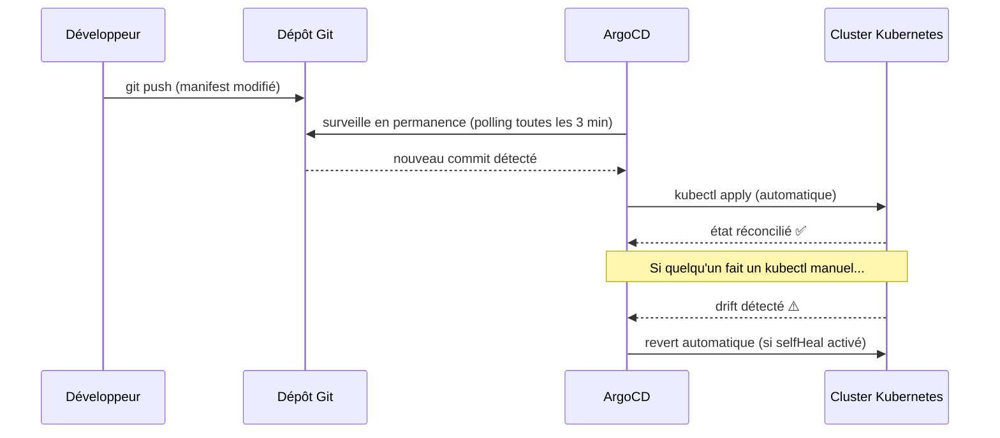
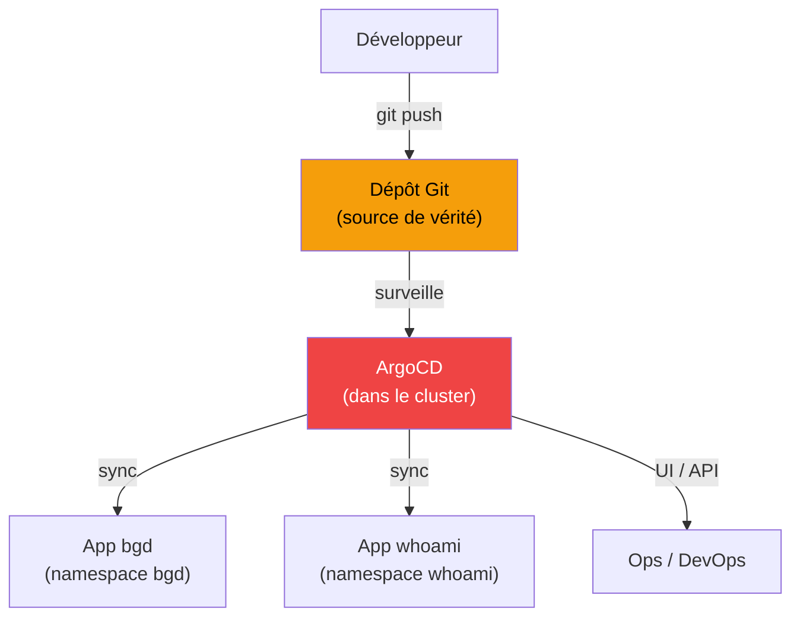

# Introduction à ArgoCD — GitOps et déploiement continu sur Kubernetes

Prérequis: on sait déployer des ressources Kubernetes à la main avec `kubectl apply`. On va maintenant introduire une approche radicalement différente : le **GitOps** avec ArgoCD.

> **Tutoriel de référence :** ce TP s'appuie sur le tutoriel officiel RedHat — [ArgoCD Tutorial: Getting Started](https://redhat-scholars.github.io/argocd-tutorial/argocd-tutorial/02-getting_started.html).

> **Prérequis :** minikube démarré, ingress addon actif (vérification à l'étape 1).

---

# PHASE 0 — GitOps : le concept

## Le problème du `kubectl apply` manuel

Jusqu'ici, le workflow ressemble à ceci :

```
Modifier un manifest YAML  →  kubectl apply  →  cluster mis à jour
```

Ce workflow fonctionne, mais il a des limites en équipe :
- **Qui a appliqué quoi ?** Pas de trace si on ne commit pas systématiquement
- **Le cluster est-il synchronisé avec git ?** Quelqu'un a peut-être fait un `kubectl` en direct sans commiter
- **Comment revenir en arrière ?** `kubectl rollout undo` mais le YAML dans git n't a pas été mis à jour
- **Environnements multiples ?** Staging, prod — appliquer manuellement sur chaque est source d'erreurs

## La réponse : GitOps

Le principe du **GitOps** est simple : **git est l'unique source de vérité**.

- On ne fait plus jamais `kubectl apply` à la main
- On commit les manifests dans git
- Un outil (ArgoCD) surveille le repo en permanence et **réconcilie automatiquement** le cluster avec l'état défini dans git



## ArgoCD en un mot

**ArgoCD** est un contrôleur Kubernetes qui implémente le GitOps :
- Il tourne **dans** le cluster Kubernetes (comme un pod)
- Il surveille un ou plusieurs dépôts git
- Il compare l'état git avec l'état réel du cluster (**diff**)
- Il applique les changements (**sync**) automatiquement ou sur demande
- Il expose une **UI web** pour visualiser et piloter tout ça

---

# PHASE 1 — Installer ArgoCD

## Etape 1 — Vérifier les prérequis

```bash
# Minikube doit tourner
minikube status

# L'addon ingress doit être actif
minikube addons list | grep ingress
# ingress                  : enabled ✅
```

Si l'ingress n'est pas actif :
```bash
minikube addons enable ingress
# Attendre que les pods ingress soient Running
kubectl get pods -n ingress-nginx
```

---

## Etape 2 — Installer ArgoCD

ArgoCD se déploie dans son propre namespace via un manifest officiel maintenu par le projet.

```bash
# Créer le namespace dédié
kubectl create namespace argocd

# Installer ArgoCD depuis le manifest stable officiel
kubectl apply -n argocd -f https://raw.githubusercontent.com/argoproj/argo-cd/stable/manifests/install.yaml
```

Cette commande crée une vingtaine de ressources : Deployments, Services, ConfigMaps, RBAC...

Attendre que tous les pods soient `Running` (peut prendre 2-3 minutes) :

```bash
watch kubectl get pods -n argocd
```

On doit voir 7 pods en état `Running` :

```
NAME                                               READY   STATUS
argocd-application-controller-0                    1/1     Running
argocd-applicationset-controller-xxx               1/1     Running
argocd-dex-server-xxx                              1/1     Running
argocd-notifications-controller-xxx                1/1     Running
argocd-redis-xxx                                   1/1     Running
argocd-repo-server-xxx                             1/1     Running
argocd-server-xxx                                  1/1     Running
```

---

## Etape 3 — Exposer l'UI ArgoCD via Ingress

Par défaut, le service `argocd-server` est de type `ClusterIP` — accessible uniquement depuis l'intérieur du cluster. On va l'exposer via un Ingress sur `argocd.local`, cohérent avec ce qu'on a fait dans le TP précédent.

ArgoCD expose son API/UI en HTTPS par défaut. Pour simplifier l'accès en local, on désactive TLS côté ArgoCD (l'Ingress gérera le HTTP) :

```bash
kubectl patch configmap argocd-cmd-params-cm -n argocd \
  --type merge \
  -p '{"data": {"server.insecure": "true"}}'

# Redémarrer le serveur pour appliquer
kubectl rollout restart deployment argocd-server -n argocd
kubectl rollout status deployment argocd-server -n argocd
```

Créer le fichier `argocd-ingress.yaml` :

```yaml
apiVersion: networking.k8s.io/v1
kind: Ingress
metadata:
  name: argocd-ingress
  namespace: argocd
  annotations:
    nginx.ingress.kubernetes.io/backend-protocol: "HTTP"
spec:
  rules:
  - host: argocd.local
    http:
      paths:
      - pathType: Prefix
        path: "/"
        backend:
          service:
            name: argocd-server
            port:
              number: 80
```

```bash
kubectl apply -f argocd-ingress.yaml
```

Ajouter `argocd.local` à `/etc/hosts` :

```bash
echo "$(minikube ip)  argocd.local" | sudo tee -a /etc/hosts
# ou avec minikube tunnel actif :
echo "127.0.0.1  argocd.local" | sudo tee -a /etc/hosts
```

---

## Etape 4 — Premier login

### Récupérer le mot de passe admin

ArgoCD génère un mot de passe aléatoire à l'installation, stocké dans un Secret Kubernetes :

```bash
kubectl -n argocd get secret argocd-initial-admin-secret \
  -o jsonpath="{.data.password}" | base64 -d
```

Copier ce mot de passe.

### Se connecter à l'UI

Ouvrir [http://argocd.local](http://argocd.local) dans le navigateur :

- **Username** : `admin`
- **Password** : le mot de passe copié ci-dessus

> **Changer le mot de passe** après la première connexion : **User Info > Update Password**.

### (Optionnel) Installer la CLI ArgoCD

La CLI permet de piloter ArgoCD depuis le terminal — utile pour les scripts et le pipeline CI/CD.

```bash
# macOS
brew install argocd

# Linux
curl -sSL -o /usr/local/bin/argocd \
  https://github.com/argoproj/argo-cd/releases/latest/download/argocd-linux-amd64
chmod +x /usr/local/bin/argocd

# Login via CLI
ARGO_PASS=$(kubectl -n argocd get secret argocd-initial-admin-secret \
  -o jsonpath="{.data.password}" | base64 -d)

argocd login argocd.local --username admin --password $ARGO_PASS --insecure
```

---

# PHASE 2 — Déployer une application avec ArgoCD

On va utiliser l'application de démonstration **bgd** (Blue Green Demo) du dépôt RedHat — une app simple qui affiche des bulles colorées. C'est un exemple public, prêt à l'emploi, qui va nous permettre de nous concentrer sur ArgoCD sans se soucier de la configuration d'accès au repo.

> **Pourquoi pas notre repo `whoami` ?** Pour pointer ArgoCD vers un repo GitLab privé, il faut configurer des credentials d'accès (deploy token, SSH key...). On le mentionnera en bonus — pour l'instant, le repo public RedHat nous permet de démarrer immédiatement.

## Etape 5 — Créer l'Application ArgoCD

Dans ArgoCD, une **Application** est la ressource principale : elle associe un dépôt git (source) à un namespace Kubernetes (destination) et définit la politique de synchronisation.

### Via l'UI

Dans ArgoCD : **+ New App**, puis remplir :

| Champ | Valeur |
|---|---|
| **Application Name** | `bgd-app` |
| **Project** | `default` |
| **Sync Policy** | `Automatic` |
| **Repository URL** | `https://github.com/redhat-developer-demos/openshift-gitops-examples` |
| **Revision** | `minikube` |
| **Path** | `apps/bgd/overlays/bgd` |
| **Cluster URL** | `https://kubernetes.default.svc` (cluster local) |
| **Namespace** | `bgd` |
| **Auto-create namespace** | ✅ cocher |

Cliquer sur **Create**.

### Via un manifest YAML (équivalent)

Créer `bgd-app.yaml` :

```yaml
apiVersion: argoproj.io/v1alpha1
kind: Application
metadata:
  name: bgd-app
  namespace: argocd
spec:
  destination:
    namespace: bgd
    server: https://kubernetes.default.svc
  project: default
  source:
    path: apps/bgd/overlays/bgd
    repoURL: https://github.com/redhat-developer-demos/openshift-gitops-examples
    targetRevision: minikube
  syncPolicy:
    automated:
      prune: true
      selfHeal: false
    syncOptions:
    - CreateNamespace=true
```

```bash
kubectl apply -f bgd-app.yaml
```

> **`kind: Application`** est une ressource custom (CRD) introduite par ArgoCD — elle n'existe pas dans Kubernetes natif. ArgoCD l'enregistre au moment de son installation.

---

## Etape 6 — Observer le déploiement

Dans l'UI ArgoCD, l'application `bgd-app` apparaît avec le statut **Syncing** puis **Healthy / Synced**.

ArgoCD affiche un **graphe de toutes les ressources** créées : Deployment, ReplicaSet, Pods, Service... et leur état en temps réel.

Vérifier côté Kubernetes :

```bash
kubectl get all -n bgd
kubectl rollout status deploy/bgd -n bgd
```

### Accéder à l'application bgd

```bash
# Récupérer le port du service bgd
kubectl get svc -n bgd

# Accès via port-forward
kubectl port-forward svc/bgd 8080:8080 -n bgd
```

Ouvrir [http://localhost:8080](http://localhost:8080) → des bulles **bleues** s'affichent.

> **Pourquoi port-forward et pas un Ingress ?** L'app bgd du tuto RedHat utilise son propre Ingress configuré pour `bgd.devnation`. Pour simplicité, on utilise le port-forward ici.

---

# PHASE 3 — GitOps en action

C'est là que ça devient intéressant. On va observer deux comportements fondamentaux du GitOps.

## Etape 7 — Simuler un "configuration drift"

Le **configuration drift** se produit quand l'état réel du cluster diverge de l'état défini dans git — par exemple, quelqu'un modifie une ressource directement avec `kubectl` sans passer par git.

### Provoquer un drift manuellement

```bash
# Changer la couleur des bulles directement sur le cluster (hors git)
kubectl -n bgd patch deploy/bgd --type='json' \
  -p='[{"op": "replace", "path": "/spec/template/spec/containers/0/env/0/value", "value":"green"}]'
```

Attendre quelques secondes et recharger [http://localhost:8080](http://localhost:8080) → les bulles sont maintenant **vertes**.

### Observer dans ArgoCD

Dans l'UI ArgoCD, l'application passe en statut **OutOfSync** ⚠️ — ArgoCD a détecté que le cluster ne correspond plus à ce qui est dans git.

Cliquer sur l'app pour voir le **diff** : ArgoCD affiche exactement ce qui diverge entre git et le cluster.

### Resynchroniser manuellement

```bash
# Via CLI
argocd app sync bgd-app

# Ou via l'UI : bouton "Sync" dans ArgoCD
```

Les bulles repassent en **bleu** — ArgoCD a réappliqué l'état défini dans git.

---

## Etape 8 — Activer le Self-Healing

Plutôt que de resynchroniser manuellement, ArgoCD peut **revert automatiquement** tout changement hors-git. C'est le **self-healing**.

```bash
kubectl patch application/bgd-app -n argocd --type=merge \
  -p='{"spec":{"syncPolicy":{"automated":{"prune":true,"selfHeal":true}}}}'
```

Reproduire le drift :

```bash
kubectl -n bgd patch deploy/bgd --type='json' \
  -p='[{"op": "replace", "path": "/spec/template/spec/containers/0/env/0/value", "value":"green"}]'
```

Observer dans l'UI ArgoCD : en quelques secondes, ArgoCD détecte le drift et re-sync automatiquement. Les bulles repassent en bleu sans intervention.

> **Self-heal en production :** puissant mais à utiliser avec précaution. Il faut s'assurer que **tout** ce qu'on veut modifier passe par git — sinon ArgoCD écrase les changements manuels d'urgence.

---

## Recap — Ce qu'on a mis en place



| Concept | Description |
|---|---|
| **Application ArgoCD** | Lie un path git à un namespace Kubernetes |
| **Sync** | Applique l'état git sur le cluster |
| **OutOfSync** | Le cluster a divergé de git |
| **Self-heal** | Revert automatique de tout changement hors-git |
| **Prune** | Supprime les ressources qui existent dans le cluster mais plus dans git |

---

## Bonus — Connecter votre propre repo GitLab

Pour pointer ArgoCD vers le repo `whoami` du TP5 (privé sur votre GitLab local) :

### Créer un Deploy Token GitLab

Dans GitLab, sur le projet : **Settings > Repository > Deploy tokens**

- **Name** : `argocd`
- **Scopes** : ✅ `read_repository`
- Copier le token généré

### Enregistrer le repo dans ArgoCD

```bash
argocd repo add http://gitlab.local/<groupe>/<projet>.git \
  --username <deploy-token-name> \
  --password <deploy-token-value> \
  --insecure-skip-server-verification
```

### Créer l'Application ArgoCD pointant sur `k8s/`

```yaml
apiVersion: argoproj.io/v1alpha1
kind: Application
metadata:
  name: whoami-gitops
  namespace: argocd
spec:
  destination:
    namespace: whoami
    server: https://kubernetes.default.svc
  project: default
  source:
    path: k8s/                  # dossier contenant les manifests du TP5
    repoURL: http://gitlab.local/<groupe>/<projet>.git
    targetRevision: main
  syncPolicy:
    automated:
      prune: true
      selfHeal: true
    syncOptions:
    - CreateNamespace=true
```

Une fois configuré : modifier `replicas` dans `whoami.deployment.yaml`, commiter, pousser → ArgoCD synchronise automatiquement.

---

## Pour aller plus loin

| Sujet | Ressource |
|---|---|
| Tutoriel complet ArgoCD (RedHat) | [redhat-scholars.github.io/argocd-tutorial](https://redhat-scholars.github.io/argocd-tutorial/argocd-tutorial/01-setup.html) |
| ArgoCD — documentation officielle | [argo-cd.readthedocs.io](https://argo-cd.readthedocs.io) |
| Argo Rollouts — Blue/Green & Canary natifs | [argoproj.github.io/argo-rollouts](https://argoproj.github.io/argo-rollouts/) |
| FluxCD — alternative GitOps | [fluxcd.io](https://fluxcd.io) |
| GitOps — guide de référence (OpenGitOps) | [opengitops.dev](https://opengitops.dev) |
